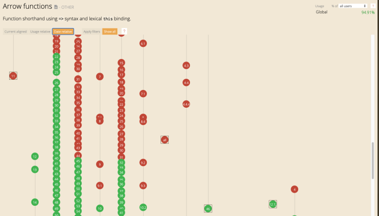
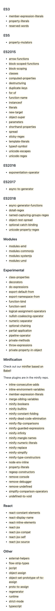

# 前言


## JavaScript

一般来说，完整的 JavaScript 包括以下几个部分：
- ECMAScript，描述了该语言的语法和基本对象
- 文档对象模型（Document Object Model，简称 DOM），描述处理网页内容的方法和接口
- 浏览器对象模型（Browser Object Model，简称 BOM），描述与浏览器进行交互的方法和接口

DOM 由万维网联盟（World Wide Web Consortium，简称 W3C）制定标准，由各大浏览器厂商实现。

BOM 没有实际意义上的标准，看浏览器厂商心情实现，但是基本上会遵循一定的约定。

## TC39

TC39（Technical Committee 39）是 ECMA 国际组织架构中的一部分，专门负责制定 ECMAScript 语言规范，它的成员由各个主流浏览器厂商的代表组成。制定规范的流程大概是这样的

- stage-0（Strawman）：脑暴阶段， TC39 的成员可以提出自己的任何想法
- stage-1（Proposal）：确定提案的 owner，讨论关键算法、概念和语义等
- stage-2（Draft）：确定实现，使用正式的规范语言精确地描述语法和语义
- stage-3（Candidate）：部分实践，例如 Babel 转换或者浏览器原生实现，尝试线上运行并收集反馈
- stage-4（Finished）：准备就绪，该特性会出现在下个版本的 ECMAScript 规范之中

需要注意的是，即使 ECMAScript 规范正式发布，还需要等待各大浏览器厂商确定是否支持这些特性，然后排期开发。例如 arrow functios 在 ES6 标准中，但是并非所有浏览器都支持，支持的时间也有先有后。




那么问题来了，在所有的浏览器厂商支持 ES 新标准前，我们在生产中如何提前使用这些标准，甚至使用处于 stage-4 甚至 stage-3 的特性呢？目前有 2 种做法：

- 将新特性转换为所有浏览器已经实现的标准，例如 TypeScript 的做法，设置 target  为 ES5、ES3
- 根据运行的浏览器环境进行新特性的转换，例如 Babel

一个是一刀切，全量转换；一个是优雅降级，按需转换。

# 简介

Babel 就是将 ES6 及其以上的代码转换成目标环境可运行的代码。核心包含三个部分

- 语法转换：例如 IE 不支持箭头函数，借助 Babel 将箭头函数转成正常的 function
- 引入 polyfill：例如 IE 不支持 Array.prototype.includes，借助 Babel 自动引入相应的 polyfill
- 源码转换（Codemod）：纯代码转换，例如官方示例 https://github.com/kentcdodds/babel-codemod-example

站在编程的角度来解释的话，Babel 就是个函数

```js
type Babel = (source: string, options: object) => string;
```

使用方式也是多样的。

## Node API
通过 API 的方式使用 Babel

```bash
npm i @babel/core --save-dev
```
 
```js
const babel = require('@babel/core');
babel.transform('code', options);
```

@babel/core 是 Babel 的核心，其它使用方式都是在此基础上的封装。

## CLI
通过命令行的方式使用 Babel

```bash
npm i @babel/core @babel/cli --save-dev
npx babel src/index.js --out-dir lib
```

## 配合 Webpack

```bash
npm i @babel/core babel-loader --save-dev
```

```js
module: {
  rules: [
    {
      test: /\.js$/,
      exclude: /node_modules/,
      use: 'babel-loader',
    }
  ]
}
```

大家可以根据具体场景选择合适的方式，也可以在 @babel/core 的基础上封装新的使用方式。

# Plugin

在演示 Babel 功能之前，我们先准备下环境，转换方式选择 cli

```bash
mkdir babel-demo
code babel-demo
npm init -y
npm i @babel/core @babel/cli --save-dev
```

新建 src/index.js

```js
const fn = () => {
  console.log('xxx');
};
```

然后通过 Babel 进行转化

```bash
npx babel src/index.js --out-dir lib
```

查看 lib/index.js，没有任何转化。

在没有配置的情况下，Babel 是不会进行任何处理的，我们需要添加相应的 plugin，例如把箭头函数转成常规的函数，需要使用到 @babel/plugin-transform-arrow-functions

```bash
npm i @babel/plugin-transform-arrow-functions --save-dev
```

然后在项目的根目录下添加文件 `babel.config.json` 或 `.babelrc.json` 或 `.babelrc` 或 `.babelrc.js`，Babel 会自动读取配置文件。个人倾向于使用 js，灵活性更好

```js
module.exports = {
  plugins: [
    '@babel/plugin-transform-arrow-functions',
  ],
};
```

这个时候我们再次运行 cli 命令，查看转换后的文件

```js
const fn = function () {
  console.log('xxx');
};
```

箭头函数已经被转成常规函数了。

Babel 的语法转换是通过一个个的 plugin 去实现的，按照 babelrc 文件里配置的顺序执行。

例如我们有个箭头函数参数补全的插件 `@babel/plugin-transform-arrow-functions-params`，进行如下的源码转换

转换前

```js
const fn = (a) => {
  console.log(args);
};
```

转换后

```js
const fn = (a, args) => {
  console.log(args);
};
```

配置顺序

```js
module.exports = {
  plugins: [
    '@babel/plugin-transform-arrow-functions-params',
    '@babel/plugin-transform-arrow-functions',
  ],
};
```

一定要确保箭头函数被转成常规函数前，先行完成参数补全的转换，否则箭头函数先被转成了常规函数，参数补全也就无法正常工作，顺序很重要。

目前 Babel 官方支持的 plugins



实际使用靠我们自己去组合这些插件明显是不现实的，除非你团队的每一个人都是大牛，深知 Babel 每个插件的作用和每个特性的浏览器兼容性，并且随着浏览器厂商对 ES 标准的支持去定期维护项目的插件。

为了让我们低成本的使用 Babel，官方提供了 preset。

# Preset

preset 就是 plugin 的集合。官方提供的 presets 中最重要的就是 env，默认已经包含了上图中的 ES3、ES5、ES2015、ES2016、ES2017、ES2018、Modules 等插件集合。

## Env

安装 preset-env

```bash
npm i @babel/preset-env --save-dev
```

Babel 配置

```js
module.exports = {
  presets: [
    '@babel/preset-env',
  ],
};
```

源码 src/index.js

```js
const fn = () => {
  console.log('xxx');
};
try {
  fn();
} catch {
}
```

通过 cli 命令转换后，lib/index.js

```js
"use strict";
var fn = function fn() {
  console.log('xxx');
};
try {
  fn();
} catch (_unused) {}
```

如果我们没有设置转换的目标环境，默认会按照 ES5 的标准进行转换，和 TypeScript 的处理一样。建议大家不要这样做，理由如下

- 转换后的代码体积会变大
- 浏览器原生支持，性能会更好

所以我们需要设置目标环境，按需转换，这也是 preset-env 存在的意义，修改配置，设置 target

```js
module.exports = {
  presets: [
    [
      '@babel/preset-env',
      {
        targets: 'chrome > 80',
      },
    ],
  ],
};
```

转换后

```js
"use strict";
const fn = () => {
  console.log('xxx');
};
try {
  fn();
} catch {}
```

目标环境 chrome80 及以上已经原生支持 arrow functions 和 optional catch binding，所以无需处理。

实际配置 target 建议大家使用 [browserslist](https://github.com/browserslist/browserslist)，根目录下新增文件 .browserslistrc，内容如下

```
chrome > 80
```

然后移除 .babelrc.js 当中的 target 配置

```js
module.exports = {
  presets: [
    '@babel/preset-env',
  ],
};
```

Babel 自动读取 browserslist 配置文件，转换的效果是一样的，这样做至少有 2 个好处

- css 的转换工具，例如 autoprefixer 也支持 browserslist 配置，可以保证项目构建目标唯一
- 团队可以提取 preset 最佳实践，使用者只需要指定目标环境，有利于团队统一和协同

另外 preset-env 只包含 TC39 已经正式发布的 ES 标准，不包含处于试验阶段的特性，对应上图中 Experimental，使用需要安装 plugin。

```
npm i @babel/plugin-proposal-class-properties --save-dev
```

```js
module.exports = {
  presets: [
    '@babel/preset-env',
  ],
  plugins: [
    '@babel/plugin-proposal-class-properties',
  ],
};
```

# Polyfill

假设这样一段源码

```js
const array = [1, 2, 3];
if (array.includes(2)) {
}
```

Babel 配置

```js
module.exports = {
  presets: [
    '@babel/preset-env',
  ],
};
```

browserslist 配置

```
ie10
```

转化后的代码

```js
"use strict";
var array = [1, 2, 3];
if (array.includes(2)) {}
```

array.includes 没有任何转换处理，不幸的是，ie10 不支持 includes 方法，上线后肯定是要背故障的。


Babel7 之前的版本是不会处理这种新增的 API，需要使用的同学自己手动引入 polyfill。忘记引入—这是导致线上问题最主要的原因。好在 Babel7，支持自动引入，首先安装 polyfill 库 core-js

```bash
npm i core-js --save
```

Babel 配置

```js
module.exports = {
  presets: [
    [
      '@babel/preset-env',
      {
        useBuiltIns: 'usage',
        corejs: 3,
      },
    ],
  ],
};
```

转换后

```js
"use strict";
require("core-js/modules/es.array.includes");
var array = [1, 2, 3];
if (array.includes(2)) {}
```

`useBuiltIns: 'usage'` 会根据目标环境引入相应的 polyfill，让大家可以放心大胆的使用新 API。

## 执行顺序

需要注意是不同于 plugins，presets 配置执行的顺序是反的，例如以下配置

```js
module.exports = {
  presets: ['preset-a', 'preset-b'],
  plugins: ['plugin-c', 'plugin-d'],
};
```

执行的顺序是 c、d、b、a

- plugins 优于 presets 执行，按顺序执行
- presets 倒序执行

# Runtime

假设有 2 个文件

```js
// src/a.js
class A {}

// src/b.js
class B {}
```

Babel 配置

```js
module.exports = {
  presets: [
    [
      '@babel/preset-env',
      {
        useBuiltIns: 'usage',
        corejs: 3,
      },
    ],
  ],
};
```

目标环境

```
ie6
```

转换后的代码

```js
// src/a.js
"use strict";
function _classCallCheck(instance, Constructor) { if (!(instance instanceof Constructor)) { throw new TypeError("Cannot call a class as a function"); } }
var A = function A() {
  _classCallCheck(this, A);
};

// src/b.js
"use strict";
function _classCallCheck(instance, Constructor) { if (!(instance instanceof Constructor)) { throw new TypeError("Cannot call a class as a function"); } }
var B = function B() {
  _classCallCheck(this, B);
};
```

很明显转换后的两个文件有重复代码，使得包体积变大，这种样板代码可以通过 `@babel/plugin-transform-runtime` 解决

安装依赖

```bash
npm i @babel/plugin-transform-runtime --save-dev
npm i @babel/runtime --save
```

配置 Babel

```js
module.exports = {
  presets: [
    [
      '@babel/preset-env',
      {
        useBuiltIns: 'usage',
        corejs: 3,
      },
    ],
  ],
  plugins: [
    '@babel/plugin-transform-runtime',
  ],
};
```

转换后的代码

```js
// src/a.js
"use strict";
var _interopRequireDefault = require("@babel/runtime/helpers/interopRequireDefault");
var _classCallCheck2 = _interopRequireDefault(require("@babel/runtime/helpers/classCallCheck"));
var A = function A() {
  (0, _classCallCheck2["default"])(this, A);
};

// src/b.js
"use strict";
var _interopRequireDefault = require("@babel/runtime/helpers/interopRequireDefault");
var _classCallCheck2 = _interopRequireDefault(require("@babel/runtime/helpers/classCallCheck"));
var B = function B() {
  (0, _classCallCheck2["default"])(this, B);
};
```

样板代码通过三方库引入，避免冗余。

# Modules

Babel 可以指定转换后的模块规范。上面例子默认都转化到了 commonjs 规范，我们可以修改配置指定为 amd 规范

```js
module.exports = {
  presets: [
    [
      '@babel/preset-env',
      {
        useBuiltIns: 'usage',
        corejs: 3,
        modules: 'amd',
      },
    ],
  ],
  plugins: [
    [
      '@babel/plugin-transform-runtime',
    ],
  ],
};
```

上面的例子转换后的代码

```js
require("core-js/modules/es.array.includes");
define(["./a"], function (_a) {
  "use strict";
  var array = [1, 2, 3];
  if (array.includes(2)) {}
});
```

```js
define(["@babel/runtime/helpers/classCallCheck"], function (_classCallCheck2) {
  "use strict";
  var _interopRequireDefault = require("@babel/runtime/helpers/interopRequireDefault");
  _classCallCheck2 = _interopRequireDefault(_classCallCheck2);
  var A = function A() {
    (0, _classCallCheck2["default"])(this, A);
  };
});
```

相信大家也发现上面的代码怪怪的，commonjs 规范和 amd 规范混用。很不幸，`useBuiltIns: 'usage'` 和 `@babel/plugin-transform-runtime` 都不支持除 es module 和 commonjs 之外的规范，所以没有转换。

没有特殊述求，建议项目统一使用 es module，目前主流的打包工具如 webpack 都已经天然支持 es module 了。

Babel 配置

```js
module.exports = {
  presets: [
    [
      '@babel/preset-env',
      {
        useBuiltIns: 'usage',
        corejs: 3,
        modules: false,
      },
    ],
  ],
  plugins: [
    [
      '@babel/plugin-transform-runtime',
      {
        useESModules: true,
      },
    ],
  ],
};
```

转换后的代码

```js
import "core-js/modules/es.array.includes";
import { add } from './a';

var array = [1, 2, 3];
if (array.includes(2)) {}
```

```js
import _classCallCheck from "@babel/runtime/helpers/esm/classCallCheck";

var A = function A() {
  _classCallCheck(this, A);
};
```
